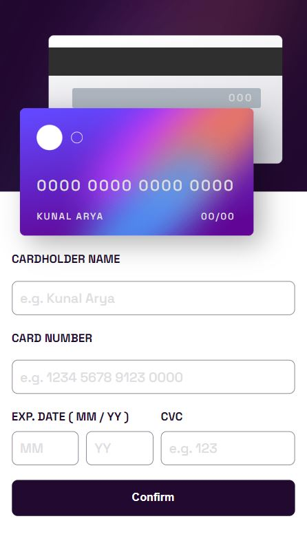

## Table of contents

- [Overview](#overview)
  - [Screenshot](#screenshot)
  - [Links](#links)
- [My process](#my-process)
  - [Built with](#built-with)
- [Author](#author)

## Overview

### Screenshot

#### Active State Desktop
  
#### Complete State Desktop  

#### Active State Mobile  
  
#### Complete State Mobile
  
  
### Links  

- Solution URL: [click here]([https://your-solution-url.com](https://github.com/kunal-arya/Interactive-card-details-form))
- Live Site URL: [click here](https://interactive-card-details-form-k.netlify.app/)

## My Process

### Built with

- Semantic HTML5 markup
- CSS custom properties
- Flexbox
- CSS Grid
- Mobile-first workflow
- [CleaveJs](https://nosir.github.io/cleave.js/) - JS library for validating card form

## Author

- Twitter - [@KunalAryaa](https://twitter.com/KunalAryaa)
